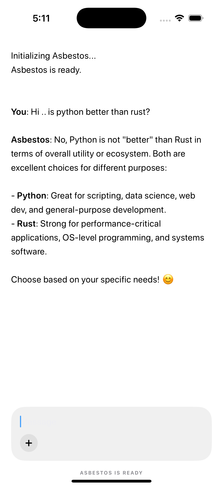

# 🧶 Asbestos

Asbestos is a high-performance cross-platform research project demonstrating the integration of the llama.cpp C++ inference engine into native mobile and desktop environments. This project showcases the ability to run Large Language Models (LLMs) and Multimodal Vision models locally on consumer-grade hardware (cpu) with minimal latency and high privacy.

<div align="center">
  
  <video src="assets/cli.mp4" width="500" controls autoplay loop muted></video>
</div>

## Project Overview

This repository provides a professional-grade implementation of on-device AI for Android, iOS, and Desktop. It leverages a unified C++ backend (llama.cpp) while providing idiomatic native experiences in Kotlin, Swift, and a specialized Vision CLI.

### Key Technical Achievements

- **Cross-Platform Inference Core**: Integrated llama.cpp as a high-performance engine across different architectures (ARM64, x86_64).
- **Android Native Excellence**: Built using the Android NDK and Kotlin. Includes a custom model downloader with real-time feedback and direct storage management.
- **iOS Metal Acceleration**: Custom-built XCFramework that leverages Apple's Metal and Accelerate frameworks for hardware-accelerated LLM inference.
- **Multimodal Vision Support**: Integrated LLaVA-style multimodal projection (mmproj) to enable image description and analysis locally via the CLI.
- **Memory and Storage Optimization**: Implemented efficient memory mapping (mmap) and disk space verification to handle large model weights on resource-constrained devices.

---

## Technical Architecture

### Android (asbestos-android)

The Android implementation uses the JDI (Java Native Interface) to call the C++ engine.

- **Language**: Kotlin, C++.
- **Build System**: Gradle with CMake for the native layer.
- **Optimization**: Compiled with NDK 26+ and optimized for ARM64-v8a.
- **Features**: Asynchronous model downloading from Hugging Face with background task management and disk space safety checks.

### iOS (asbestos-ios and asbestos-ios-app)

The iOS implementation is split into a reusable Swift Package and a demonstration SwiftUI app.

- **Language**: Swift.
- **Acceleration**: Uses Metal for GPU-based inference and Accelerate for CPU-based BLAS operations.
- **Build System**: XCFramework containing slices for both physical devices and simulators (arm64/x86_64).
- **Features**: SwiftUI-based chat interface with MainActor-safe state management for real-time token streaming.

### Desktop & Vision (asbestos-cli)

Includes a dedicated runner for multimodal vision tasks. This component bridges the core C++ engine to perform complex visual analysis on-device.

- **Tools**: Custom `vision.sh` bridge using `llama-cli`.
- **Capabilities**: Local image understanding, OCR, and descriptive analysis without external APIs.

---

## Model Sources

This project is optimized for the Qwen series of models due to their exceptional performance-to-size ratio.

- **Primary Model**: [Qwen 3.5 0.8B (Quantized GGUF)](https://huggingface.co/bartowski/Qwen_Qwen3.5-0.8B-GGUF/tree/main)
- **Vision Projector**: [mmproj Qwen 3.5 0.8B (bf16)](https://huggingface.co/bartowski/Qwen_Qwen3.5-0.8B-GGUF/tree/main)

### Vision CLI Commands

The Vision component can be executed directly to analyze images:

```bash
./asbestos-cli/vision.sh <path_to_image> "Describe this image in detail."
```

---

## Challenges and Solutions

Building on-device AI requires overcoming several hardware and software limitations.

### 1. NDK and CMake Build Conflicts (Android)

Challenge: The initial Android build failed during native compilation because the llama.cpp project required newer CMake features than the default Android Studio environment provided.
Solution: Manually configured the app's build.gradle.kts to use CMake 3.22.1 and disabled incompatible optimization flags (GGML_CPU_KLEIDIAI) that were causing library fetch errors.

### 2. Disk Space and Memory Safety (Mobile)

Challenge: Transferring 800MB+ model files to a mobile device often resulted in IOExceptions or system crashes when the device reached capacity.
Solution: Implemented pre-download disk space verification logic using Java's StatFs and Swift's FileManager. The app now checks available block sizes before beginning a download.

### 3. Swift Concurrency and State Updates (iOS)

- Challenge: Updating the UI during real-time token generation caused race conditions and thread-safety warnings when coming from background C++ callbacks.
- Solution: Refactored the LlamaState manager to use Swift's @MainActor isolation. All background token updates are now wrapped in Task { @MainActor in } blocks.

### 4. Cross-Platform XCFramework Header Issues (Apple)

- Challenge: Creating a unified bundle for iOS and Simulators initially failed because modern llama.cpp headers were missing from the search path during module-map generation.
- Solution: Wrote a custom build-ios-xcframework.sh script that explicitly handles header copying and module-map linking.

---

## Future Work

- **Multimodal Vision for iOS and Android**: Bring the image understanding capabilities (currently CLI-only) to the mobile apps by integrating the mmproj vision projector, an image picker UI, and combined image+text tokenization.
- **Conversation Persistence**: Save and restore chat history across app sessions using local storage (Core Data on iOS, Room on Android).
- **Voice Input**: Add speech-to-text support for hands-free interaction with the AI assistant.
- **Model Selection**: Allow users to switch between different downloaded models from within the app.

---

Developed as a technical showcase for local, private, and high-performance mobile AI.
